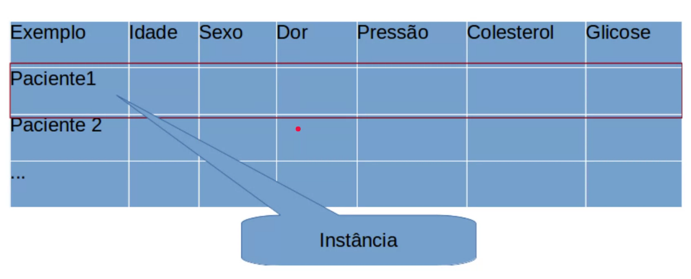
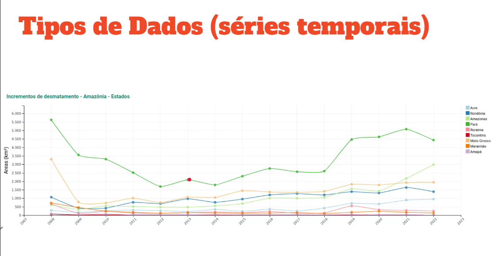
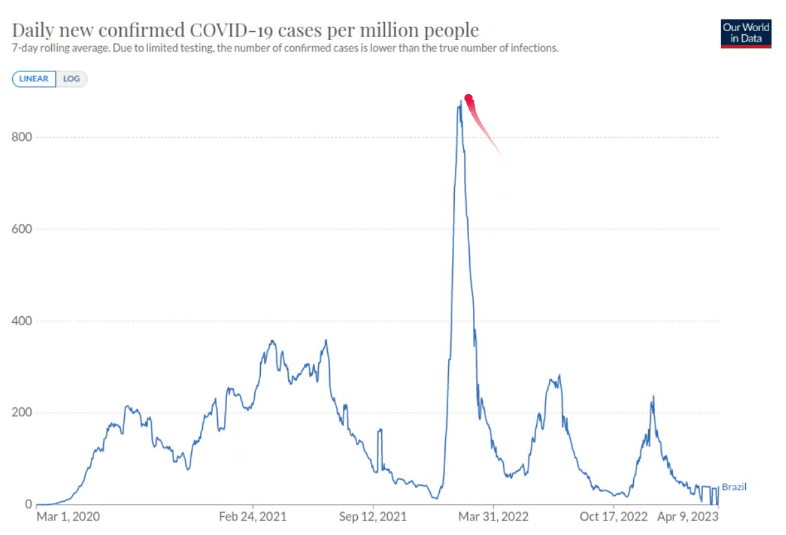

# Ciência de dados
- Área do conhecimento que estuda e aplica princípios e técnicas, por meio de algoritmos, para extrair conhecimento novo, relevante e útil de um conjunto de dados

- Combinação da **Computação**, **Domínio de Conhecimento** e a **Matemática Estatística**

## Big Data

### 2001: os 3V's

- **Volume:** grande quantidade de daodos
- **Velocidade:** rapidez com que esses dados são gerados e produzidos
- **Variedade:** diferente tpos e formatosque os dados assumem

### V's Atualizados

- **Veracidade:** quão confiáveis são os dados -> qualidade
- **Valor:** quanto valem as informações existentes nos dados
- **Variabilidade:** estabilidade do sistema
- **Visualização:** interpretação

## Tipos de Dados
### Tipo mais comuns de dados:
- Tabulares, estruturados
- Textos
- Imagens e vídeos
- Séries, tipo de sinal que se armazena diversos valores coletados ao passar do tempo.
- Grafos

### Dados tabulares
- Matriz Atributo-Valor: Emxn
- Dados estruturados possuem caracteristicas

- Podem ser entendidos em formatos de planinhas com coluanas e linhas, onde uma linha signifíca uma instância

### Dados em Séries
- Conjunto de dados coletados e armazenados de um mesmo ramo, levando em consideração diversos fatores
- Manipular um sistema ao longo do tempo, exemplo temperatura média 

## Formatos de Dados
- CSV(comma-separated values) e planinhas
- XML e JSON

## Inteligência Artificial
- **Inteligência Artificial Fraca**, trata-se de desenvolver um algoritmo que resolva um problema de maneira inteligente

## Projeto CD
- 1° **Pré-processamento**, organizar os dados com base nos algoritmos de processamento, **limpar os dados**
- 2° **Modelagem**
- 3° **Validação**, certifica se o algoritmos realmente está aprendendo

## Ciclo de Vida dos Dados
- Coletar
- Preparar
- Processa
- Publicar
- Preservar ou Destruir

### Data lakes: 
Repositório para armazenar uma grande quantidade de dados em seu formato original

- Otimizados para dimensionamento para terabytes e petabytes de dados
  
- Dados coletados de várias fontes heterogêneas: 
- - Estruturados
- - Semi-estruturados
- - Não-estruturados
  
- Quando usar:
- - Exploração e análise de dados
- - Aprendizado de Máquina
- - Fornecer dados para Data Warehouses
- - Streams
- - IoT
  

### Governança:
Conjuntos de práticas (estratégias) para gerenciar dados grantindo:
- Qualidade
- Integridade
- Segurança
- Usabilidade
- Responsabilidade

 

### Curadoria
- Metadados
- Facilidade de exploração
- Autenticação
- Documentação
- Validação
- Registros de logs

 

## Reprodutibilidade
- Compartilhamento de códigos
- Compartilhamento de dados
- Garantia do resultado ser sempre o mesmo independente do número de execuções

##